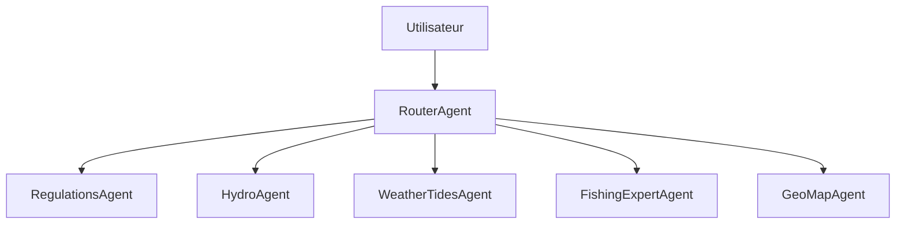

# Architecture multi-agents — peche-agent

Document d'exploration pour une évolution au-delà de l'agent Gemini unique actuel.

## État actuel

- **Orchestrateur** : [`peche/agent/loop.py`](../peche/agent/loop.py) → LangGraph ([`peche/agent/graph/`](../peche/agent/graph/)).
- **Routeur** : heuristiques + `gemma-4-26b-a4b-it` si ambigu ; rate-limiter [`rate_limit.py`](../peche/agent/graph/rate_limit.py).
- **Agents** : regulations, hydro, weather, fishing, geomap — outils partagés par sous-ensemble.
- **Observabilité** : LangSmith (`LANGCHAIN_TRACING_V2`, projet `peche-agent`).
- **Sous-agent** : [`fishing_expert.py`](../peche/agent/fishing_expert.py) via `get_fishing_advice`.

## Architecture cible

| Agent | Responsabilité | Outils |
|-------|----------------|--------|
| **Router** | Classification d'intention, délégation, synthèse finale | optionnel : `search_plans` léger |
| **Regulations** | Zones, plans, segments, règlements en vigueur | `list_zones`, `search_plans`, `get_reglements` |
| **Hydro** | Niveaux multi-stations, débits, qualité d'eau | `get_hydromet_for_waterbody`, `search_stations`, `get_water_levels`, `get_iqbp` |
| **WeatherTides** | Météo et marées | `get_weather*`, `get_tides*` |
| **FishingExpert** | Leurres, techniques, stratégie | `get_fishing_advice` |
| **GeoMap** | Contexte spatial, carte | futur `get_map_context` |

## Cas d'usage

1. **« Puis-je pêcher la truite à Ste-Marguerite demain ? »**  
   Router → Regulations (segments + règlements) + WeatherTides → synthèse.

2. **« Niveau du Lac Kénogami »**  
   Router → Hydro (`get_hydromet_for_waterbody`, metrics=level) → tableau + graphique multi-barrages.

3. **« Quel leurre pour le saumon sur la Chicoutimi ? »**  
   Router → Hydro + WeatherTides → FishingExpert avec `conditions` structurées.

4. **Planification de sortie**  
   Router orchestre Hydro + Wx + Reg en parallèle, puis synthèse unique.

## Migration progressive

1. Conserver `loop.py` comme orchestrateur initial.
2. Extraire des prompts spécialisés par domaine (fichiers `prompts/regulations.py`, etc.).
3. Ajouter un routeur léger (règles ou petit modèle) avant la boucle d'outils.
4. Generaliser le patron `fishing_expert.py` pour Hydro / Reg si besoin de raisonnement sans outils.
5. Option avancée : framework multi-agents (LangGraph, ADK) si la complexité des enchaînements augmente.

## Risques

- Latence : plusieurs appels LLM séquentiels.
- Cohérence : le Router doit éviter les réponses contradictoires entre agents.
- Coût tokens : duplication de contexte — mutualiser `search_plans` une seule fois.
  - gemini-3.1-flash-lite = 15 req/min et 500 req/j
  - gemma-4-31b-it = 15 req/min et 1500 req/j (tache simples)
  - gemma-4-26b-a4b-it = 15 req/min et 1500 req/j (tache très simples)
